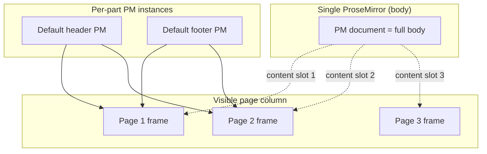

# DOCX paged renderer

> Status: P3.3 spec. Drives W9 (chunker), W10 (PageFrame), W11 (mount),
> W12 (status bar), W13 (zoom). Followed by P3.4 (header/footer
> authoring) and P3.5 (page-aware editing UX).

## Why

The user's masterthesis fixture is 26 Word pages. Today the editor
renders one continuous text column. Word users expect visible page
boundaries with margins, page numbers, and editable header/footer
zones in the right slots.

## Architectural call: single PM, page chrome on top

`spec/docx/eigenpal-synthesis.md` documents the eigenpal "dual rendering"
trade-off: hidden ProseMirror owns selection / typing, visible
"layout-painter" rebuilds static DOM on every transaction. Their
`CLAUDE.md` warns this creates a permanent "two truths" tax.

We avoid it. **A single ProseMirror instance owns the body content for
the whole document**, and per-page chrome is drawn around chunks of that
content using PM Decorations and NodeView-style content holes. The
paged view IS the editing view; selection, IME, undo, drag-drop, and
`toDOM` continue to live in PM.

Header / footer parts ARE rendered as separate small PM instances
because their content lives in separate OOXML parts (`word/header1.xml`,
etc.) — that's a one-truth-per-part design, not a two-truth-per-document
one.



### How the body PM lives across page frames

ProseMirror requires a contiguous DOM region as its `dom` element. We
get there with this layout:

1. The body PM mounts into a single off-page `<div class="pm-flow">` —
   normal PM behaviour.
2. The page column renders an array of `<PageFrame>` components in
   document order.
3. Each `<PageFrame>` body region uses `position: relative` and overlays
   the corresponding slice of `pm-flow` via `transform` + clipping. The
   frame supplies the visual page chrome (margins, header/footer slots,
   page-number footer); the body content is the same DOM nodes PM is
   already managing.

This gives PM one continuous document while the user sees N page
frames. There's no second DOM; the "pagination" is purely visual
clipping + repositioning of PM's existing rendered DOM.

### Contingency

If, during W11, this layout interacts badly with PM's mutation
observers (PM expects to own its `dom` subtree exclusively, and
`transform` should not affect that — but we'd be slicing across
ranges), fall back to a CSS columns-style layout where `pm-flow`
itself is broken into pages by `column-break` and the page chrome is
drawn behind/around it. As a final fallback only, switch to the
eigenpal-style dual-render and document the tax in
`docs/build-log/docx.md`.

## Page chunker (W9)

Pure function. New file
`packages/docx/src/renderer/page-chunker.ts`.

```ts
export interface PageChunk {
  /** Index of the first body block on this page. */
  readonly startBlock: number;
  /** Index just after the last body block on this page. */
  readonly endBlock: number;
  /** Section the page belongs to (drives geometry & header/footer choice). */
  readonly sectionIndex: number;
  /** 1-based page number across the whole document. */
  readonly pageNumber: number;
  /**
   * Page number within the current section. Word resets this on every
   * section break with `<w:pgNumType w:start>`, but we ignore that
   * subtlety for P3 and just compute global page numbers; per-section
   * numbering is a P4 polish item.
   */
  readonly pageWithinSection: number;
}

export interface PageGeometry {
  readonly pgSz: PageSize;
  readonly pgMar: PageMargins;
}

export type Measure = (blockIndex: number) => number;

export function chunkIntoPages(snapshot: DocxSnapshot, measure?: Measure): ReadonlyArray<PageChunk>;
```

### Algorithm

```
sections        = enumerate body, group blocks by which SectionBreak they precede
currentPage     = []
pageNumber      = 1
sectionPageNum  = 1

for each section (geometry, blocks):
  contentHeight = pgSz.h - pgMar.top - pgMar.bottom
  for each block in blocks:
    // Hard breaks
    if block contains explicit PageBreakLeaf at the start:
      flush currentPage
    // Hint breaks
    else if block contains LastRenderedPageBreakLeaf and measure not provided:
      flush currentPage if it has content
    // Measured breaks
    else if measure and accumulated > contentHeight:
      flush currentPage
    push block to currentPage
  flush currentPage at section boundary if non-empty
```

`measure` is optional so the chunker is unit-testable from Node (no DOM
access). The editor passes a real measurer that uses
`element.getBoundingClientRect()` on the rendered PM blocks.

### Caching

The chunker is called on every transaction. We memoize on
`snapshot.dirty.body` — when body is clean, the previous chunk array is
returned with page numbers re-computed only if the section list
changed. Edit-localized recomputation (only re-measure from the dirty
paragraph forward) is a polish item; P3 starts with full recompute on
every transaction.

## `<PageFrame>` component (W10)

`apps/web/app/editor/PageFrame.tsx`:

```tsx
interface PageFrameProps {
  pageNumber: number;
  totalPages: number;
  geometry: PageGeometry;
  zoom: number; // 0.5 .. 1.5
  headerSlot: ReactNode | null;
  footerSlot: ReactNode | null;
  bodySlot: ReactNode; // The clipped PM region for this page.
}
```

Renders:

```
┌──────────────────────────────────┐  ← page background, A4 / Letter @ zoom
│ ┌──────────────────────────────┐ │
│ │ headerSlot (pgMar.header)    │ │
│ ├──────────────────────────────┤ │
│ │                              │ │
│ │ bodySlot                     │ │
│ │   pgMar.top  / pgMar.bottom  │ │
│ │   pgMar.left / pgMar.right   │ │
│ │                              │ │
│ ├──────────────────────────────┤ │
│ │ footerSlot (pgMar.footer)    │ │
│ └──────────────────────────────┘ │
│  Page N of M                     │  (status outside the page chrome,
└──────────────────────────────────┘   below the page; not on every page)
```

Geometry is rendered in CSS pixels: `1 twip = 1/1440 inch`,
`1 inch = 96 css px`. So `width = pgSz.w / 1440 * 96 * zoom`. Matches
how Word at 100% zoom renders.

## Mount changes (W11)

`packages/docx/src/renderer/mount.ts`:

- `mountDocxEditor` now returns a controller with `getPageChunks(): PageChunk[]`.
- The React layer (`apps/web/app/editor/DocxEditor.tsx`) wraps the existing
  PM mount in a `<PagedView>` that maps `pageChunks` to `<PageFrame>`s.
- `PagedView` computes header/footer slots per page via
  `resolveHeaderFooterParts(snapshot, chunk.sectionIndex)` and
  `firstPageRule(chunk)`, instantiating per-part PM instances on demand
  (memoized; a single header part is shared across all pages that use
  it, with each page's slot rendering a clone of the part's DOM).

Visual placement: each `PageFrame.bodySlot` measures its rect after
mount, and a separate "PM positioner" effect translates the
corresponding PM block range into that rect. Selection rects come from
PM's standard `coordsAtPos` with the per-page transform applied.

## Status bar updates (W12)

`apps/web/app/editor/StatusBar.tsx` already shows `Page 1 of N`-style
info. Update its source from "estimated by paragraph index" to "current
page from chunker, total = chunks.length".

`useCurrentPage()` hook: IntersectionObserver on each `<PageFrame>`
container; whichever frame is most-visible is the current page. PM
selection-change is also a trigger — if the caret jumps to a chunk
that's off-screen, the status bar still reflects the caret's page.

## Zoom (W13)

Bottom-right zoom slider (50% / 75% / 100% / 125% / 150%, plus a
free-form input). Stored in editor state, applied via `--page-zoom` CSS
variable on the editor root. Page frames scale via `transform: scale()`;
PM internals scale via `font-size: calc(1em * var(--page-zoom))` is NOT
used (would break OOXML round-trip of font sizes); instead the entire
`pm-flow` is `transform: scale(var(--page-zoom))` and PM measures in
unscaled CSS px which is what `coordsAtPos` returns naturally.

The chunker is invariant under zoom — page splits are determined by
unscaled geometry, not by viewport.

## Header / footer interactions (foreshadowing P3.4)

P3.3 renders header/footer slots as **read-only previews** (the PM
instance for the part exists but the editor surfaces it disabled).
P3.4 adds the focus model: clicking a header zone activates that
part's PM, greys out the body PM, and routes keyboard / toolbar
to the active part. Two PM instances cannot both have native focus
simultaneously, so we route through a single `activePart` state in
the editor.

## Acceptance (P3.3)

- Open masterthesis fixture: visible page boundaries match Word's
  page count (26).
- Scrolling shows real page chrome with header / footer content
  visible.
- Page-number status bar updates as the user scrolls.
- Zoom slider scales the page chrome smoothly without affecting
  selection geometry.
- Round-trip byte-equality unchanged (renderer is read-only against
  the snapshot; no mutations introduced).

## Out of scope (P3.3)

- Header / footer editing (P3.4).
- Insert page break command (P3.5).
- Per-section restart of page numbering (P4 polish).
- Print preview (separate concern, not requested).
- Live re-pagination during typing (P3 only re-measures on
  transaction; P4 may optimize).
